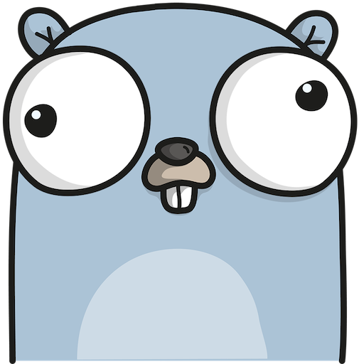
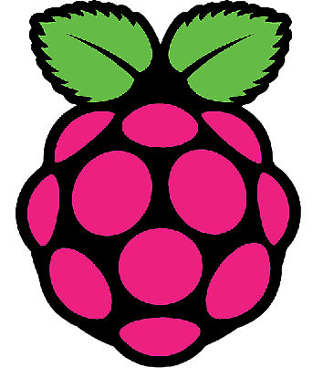
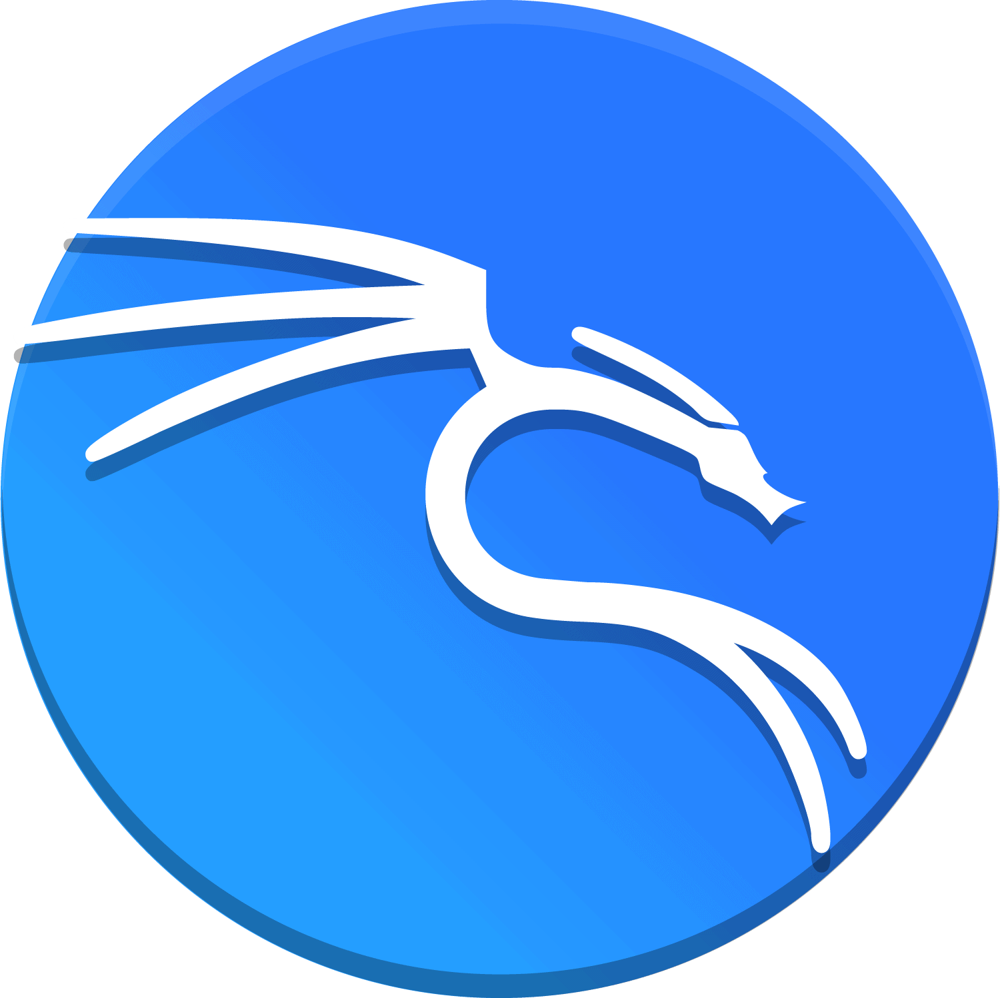

<H1>👋 Hi there !!!!</H1>

## root@xettabyte~$ whoami 
Ariful Anik || Ethical Hacker || Bug Bounty Hunter || SBC and Cloud Enthusiast 

## root@xettabyte~$whatiamfocusingfornow 
⭕Bug Bounty  
⭕linux System Administration 
⭕Web Application and Cloud Security 
 

<h3 align="left">I LOVE 😍:</h3>

   
 
 
 
 
 
  
  
  
  
  
  
  

  

<h3 align="left">Connect with me:</h3>

  

<h3 align="left">Blog : https://xettabyte.me/</h3>
<!---
4riful/4riful is a ✨ special ✨ repository because its `README.md` (this file) appears on your GitHub profile.
You can click the Preview link to take a look at your changes.
--->
